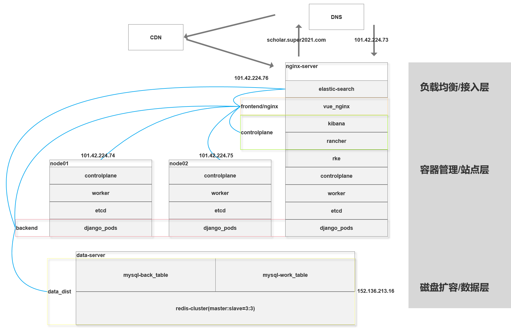

### 架构图

#### 初始构想

由于资金问题，将服务集成在三台内网互联的服务器内，使用rancher控制面板搭建k8s，其中前后端以及数据存储分布放在三台服务器的容器中。ingress-nginx组件可以供负载均衡、而多master和etcd集群保证了高可用。但是随着项目的推进，发现了这样的架构存在着问题。

##### 问题1

由于学术分享平台需要数据量巨大，如果redis分布在服务器中的话，那么三台服务器都要挂载一定容量的磁盘，需要一定开支。

##### 问题2

mysql单点放置在node02中会增大开支，并且做为备份而存在的数据库放在容器中管理起来，虽然是内网，但是并没有体现出来有多么方便。

##### 问题3

由于k8s的ingress组件和linux内核存在着不适配，导致在个人虚拟机上进行压测时，频繁出现5s请求延时，经在网上搜索发现需要[修改容器内部配置](https://tencentcloudcontainerteam.github.io/2018/10/26/DNS-5-seconds-delay/)，虽然经过一番测试后实现了需求，但是毕竟是容器，如此修改并不可靠。

##### 问题4

使用ingress-nginx的组件可能引发端口冲突，排查未果。

##### 问题5

前端可能不需要分多个微服务，并且共享的文件可能产生冲突。

#### 当前架构

在思考了以上问题后，将原有架构改为当前架构。

主体仍然是三个服务器，对于之前的问题1和问题2，单独使用了一个数据服务器来存储数据，只需要挂载一个大容量数据盘；对于之前问题3和问题4，使用一台负载均衡服务器，对在节点服务器上的服务进行转发，从而实现负载均衡。elastic-search比较吃内存，将其和nginx集成在高性能的云服务器中；对于问题5，将其放在高性能服务器中，一方面用作前端容器，另一方面可使用里面的nginx做一级的负载均衡。

使用高性能服务器可以让K8s集群中存放更多的pod，使得后端达到快速响应的功能。

### Makefile

使用一级目录下的make node0x指令即可。

### rke

rke配置在cluster_detail.txt文件下。

### docker

docker下面存放着Dockerfile以及k8s容器生成代码。

### 运行说明

将项目放置在任意目录下，运行对应make指令即可搭建集群。

make node01：包含rke的初始化k8s节点。

make node0x：初始化k8s的节点。
